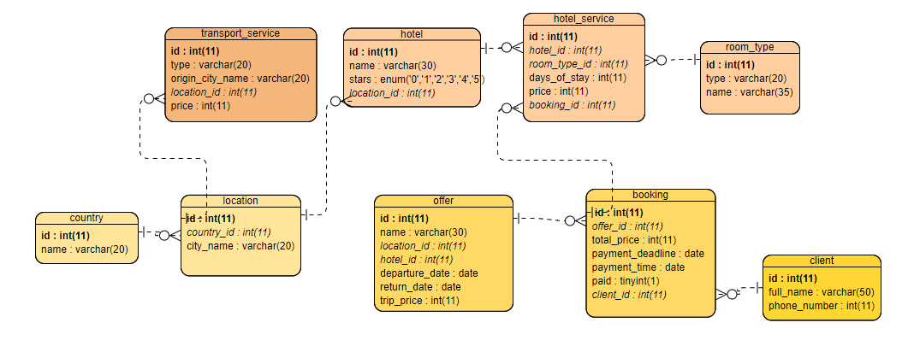

# TravelAgency
This is a simple console application that allows user to perform operations on travel_agency database. TravelAgency is a databases course project. It was created with Python 3.8 and PyMySQL, sys modules.
## Description
TravelAgency allows you to access travel_agency database as a client or as an employee. Client and employee interfaces have different functionalities.
### SQL queries 
Examples of SQL queries that were used in the app.
1. Select all trip offers where trip price is less than 2000 and hotel standard is at least 3-star.
```sql
  SELECT o.name,  l.city_name AS city, c.name AS country,
  h.name as hotel, h.stars, o.trip_price FROM offer o 
  INNER JOIN location l ON o.location_id = l.id 
  INNER JOIN country ON l.country_id = c.id 
  INNER JOIN hotel h ON o.hotel_id = h.id
  WHERE o.trip_price < 2000 AND h.stars IN ("3","4","5");
 ```
2. Add new client
```sql
INSERT INTO client (id, full_name, phone_number)
VALUES ('{id_}', '{full_name}', '{phone_number}');
```

### Database

*travel_agency database*
